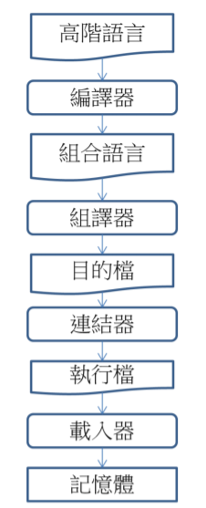
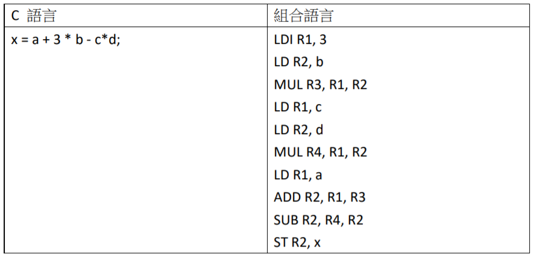

# 系統程式簡介

## 何謂系統程式？

系統程式這個名詞很難有一個公認的定義，在台灣大專院校的資訊工程系課程當中，系統程式通常被翻譯為 System Software 或 System Programming，但是，這兩個詞彙雖然緊密相關，但卻有著不同的意義。

System Software 的中文是系統軟體，但是，甚麼是系統軟體呢？一個不精確的說法是：『系統軟體是相對於應用軟體而言的，凡是專門設計給程式設計師使用的軟體，就被稱為系統軟體，而設計給一般大眾使用的軟體，則稱為應用軟體』。

根據上述定義，凡是程式設計師專用的軟體，就稱為系統軟體，因此，組譯器、載入器、連結器、巨集處理器、編譯器、直譯器、虛擬機等等，都很明確的被視為是系統軟體。而試算表、排版軟體、瀏覽器等程式，則是給一般大眾使用的，因此被視為是應用軟體。但是對於某些由程式設計師與一般人共同使用的軟體，像是文字編輯器、資料庫管理系統等等，是否納入系統軟體中，則很難有標準的解釋。

System Programming 的中文是系統程式，指的是系統相關的程式設計技術，然而，在此處的系統一詞究竟指的是甚麼系統呢？這有兩種解釋，一種是作業系統、另一種是電腦系統。因此，系統程式是與『作業系統』或『電腦系統』相關的程式開發的技術。

根據此種解釋，以較為狹義的定義，系統程式專指與作業系統相關的程式設計，包含設計作業系統，以及作業系統層次的程式設計，像是 Linux 系統程式，Windows 系統程式等。這些主題包含『行程管理』、『執行緒』、『行程通訊』、『並行控制』、『記憶體管理』、『檔案輸出入』、『驅動程式』等等，這些主題都是作業系統層次的程式設計重點。

然而，若採用較廣義的解釋，系統程式則可以擴大到與電腦系統相關，特別是與硬體相關的程式，這包含『組合語言』、『C 語言』、『嵌入式系統』等主題，都可以被納入到系統程式當中。而與電腦硬體系統較無關的高階應用程式設計，像是遊戲、資料庫、多媒體程式設計等，則不應納入系統程式的範圍。

那麼，『系統軟體』與『系統程式』兩者之間，又有甚麼關係呢？關於這點，必須從程式設計師的角度，才能得到解答。

當程式設計師撰寫程式時，可能使用『高階語言』或『組合語言』。然而，要讓這些程式能實際在電腦上運行，必須使用許多工具，這些工具就是前述的『系統軟體』。

接著，讓我們看看系統軟體與系統程式之間的關係。

## 系統程式與系統軟體

高階語言的程式設計師，會使用『編譯器』將程式編譯為『組合語言』，然後組合語言又再度被『組譯器』組譯，於是產生了『目的碼』。接著，這些目的碼經過連結的程序，形成『可執行檔』。只有在可執行檔接著被『載入器』載入到記憶體之後，程式才會真正開始執行。以下這些過程的流程示意圖。

通常，程式開發是一個漸進且冗長的過程，程式人員必須經過撰寫、編譯、測試、修改、再編譯、再測試… 等過程，才能開發出一個有用的程式。因此，這些系統軟體被使用的頻率會非常高。往往在一個軟體的開發過程當中，會產生數百、數千、甚至數萬次的修改。假如程式人員能夠更熟悉這些系統軟體的用法及原理，那麼對其工作將會有莫大的幫助。

## 從機器語言到組合語言

在電腦的發展史上，最早出現的程式是機器語言，也就是一連串 0 與 1 位元，這也是電腦可以直接執行的語言，舉例而言，機器語言可能如下所示

> 範例一： (二進位串列形式的指令) 00010011000100100011000000000000

對於人類而言，通常很難理解這種指令的意義，因為二進位的表示法相當的冗長，難以為人類所辨識。為了讓人們更容易閱讀這些指令，通常我們會將這些二進位碼以每四個一組的方式，中間採用空白隔開，如以下範例所示。這將有助於二進
位碼的閱讀。

> 範例二： (二進位分組形式的指令)：0001 0011 0001 0010 0011 0000 0000 0000

即便如此，對於人們而言，仍然會覺得這樣的表示法過於冗長。為了以更精簡的方式表達上述指令，我們可以用十六進位形式表達上述指令，每四個二進位數字(0-1) 會對應一個十六進位數字 (0-9, A-F, 其中 A 代表十進位的 10、B 代表 11、以此類推)。因此，範例二的二進位字串將會被改寫為範例三的十六進位字串，讀者可以仔細換算看看。

> 範例三：(16 進位分組形式的指令)：13 12 30 00

很顯然的，範例三當中的 16 進位形式比起範例二當中的二進位形式短了許多。

因此，更容易為人類所閱讀。然而，一般人仍然很難看出該指令的意義。

為了讓人類更容易理解機器指令，於是早期的電腦發明家使用文字的形式，代替這些機器指令。這些用來代替機器指令的文字，就稱為組合語言指令，舉例而言，下列組合語言指令所代表的，正是範例三當中的機器指令。

> 範例四：ADD R1, R2, R3

你看出來了嗎？範例四的組合語言指令，如何對應到範例三中的機器指令呢？如果我們將這兩個指令寫在一起，會比較容易看出其對應關係，範例五顯示了這個對應關係。

> 範例五：組合語言與機器指令的對應關係
>
> ADD R1, R2, R3
> 
> 13 1 2 3 000

在範例五當中，組合語言指令 ADD 被對應到十六進位的指令碼 13，也就是二進位的 0001 0011。暫存器 R1, R2, R3 則直接被編為十六進位碼中的 1, 2, 3，也就是二進位的 0001 0010 0011。最後，由於該指令為 32 位元的指令，因此、我們必須在未滿 32 位元的部分補上 0 作為結尾。這種對應方式相當明確，只要給出一張指令編碼表，我們也可以透過人腦翻譯，將組合語言轉換為十六進位的指令碼。這個過程，就稱為組譯。

但是，現實生活中的電腦指令，通常沒有這麼容易對應。因為機器指令的格式通常既多樣又複雜，很少像上述範例一樣簡單。還好基本原理是相同的，只要有足夠的耐心，透過一張指令格式與編碼表，人腦仍然可以將電腦的組合語言翻譯為機器指令。

當然，這件事如果要由人類來做，那翻譯指令的人必然為數眾多，而且所做的事情將會非常無趣。所以早期的程式設計師決定讓程式自動完成這件事情，於是撰寫出了組譯器，以便將組合語言轉換為機器指令，再交由電腦執行。

組合語言乃是 CPU 指令集的延伸，撰寫時通常以列為單位，一個指令占據一列，每個指令都是以『指令碼 + 參數』的方式，一列接著一列。例如，以下是一個ARM 處理器的加法指令。

> 指令 1：ADD R1, R2, R3

指令 1 的意義相當於 C 語言中的 R1 = R2+R3，但是作用的對象是暫存器，而非C 語言中的變數，同樣的，ARM 處理器中的減法指令如下所示。

> 指令 2：SUB R1, R2, R3

指令 2 對應到 C 語言就成了 R1 = R2 – R3

在 C 語言當中，並沒有暫存器的概念，暫存器是 CPU 當中可用來快速存取的儲存器。通常，如果一個 CPU 是 32 位元的，那其中的暫存器也會是 32 位元的。舉例而言，手機當中常用的 ARM 系列 CPU，通常有 R0, R1, …, R15 等 16 個暫存器，可以供 CPU 儲存運算用的資料。然而，在 CPU 當中，某些暫存器可能具有特殊用途，例如 ARM CPU 中的 R15 就是程式計數器 (Program Counter :PC)，用來儲存指令的記憶體位址，因此也往往被寫成 PC。

有時，由於所使用的組譯器的不同，會導致組合語言的語法也有所不同。舉例而言，假如我們將指令 1 改寫為『目標後置』的形式，則其語法將變更如下。

> 指令 3：ADD R2, R3, R1

因為在目標後置的組譯器當中，最後一個運算元才是目標暫存器。因此，指令 3 與指令 1 的意義是相同的，同樣對應到 C 語言當中的 R1 = R2+R3。

在指令當中，參數部分並不一定是暫存器，也可能是常數或記憶體位址。舉例而言，下列指令中的 300 就是一個記憶體位址。

> 指令 4：LD R1, [300]

指令 4 的意義是，要將記憶體位址 300 內的資料值，取出後放入暫存器 R1 當中，其中的 LD 指令代表載入動作，而 [300] 代表位於記憶體 300 當中的值，這個指令若寫成類似 C 語言的寫法，則會是 R1 = [300]。

在某些 CPU 當中，會允許算術指令直接存取記憶體。例如，以下指令會將位址300 的記憶體內容取出後與 R2 相加，然後再放入到暫存器 R1 當中。

> 指令 5：ADD R1, R2, [300]

此種設計讓我們可以不用先將記憶體的內容載入，就可以直接進行加法。這個指令若寫成類似 C 語言的寫法，則會是 R1 = R2 + [300]。

在組合語言當中，由於有變數的觀念，所以可以用變數 (像是 COUNT) 取代 [300] 這樣的寫法，以下是一個使用變數的範例。

> 指令 6：ADD R1, R2, COUNT

在指令 6 當中，我們用變數 COUNT 取代了指令 5 當中的 [300]，其意義相當於 C 語言語法中的 R1 = R2 + COUNT。這樣的寫法較容易閱讀。如果能夠賦予變數適當的名稱，就能更容易的理解變數的意義。

但是，允許算術指令存取記憶體，通常會造成指令長度的增加，因而減慢執行速度。為了避免指令太長，就必須要降低參數個數。例如，將三個參數的加法指令縮減為兩個參數。

> 指令 7：ADD R1, COUNT

在指令 7 當中，暫存器參數少了一個。那麼，到底變數 COUNT 是與誰相加呢？

這個問題的答案是，與第一個參數的暫存器 R1 相加。於是，指令 7 相當於 C 語言中的 R1 = R1 + COUNT。

甚至，對於某些更原始的 CPU 而言，為了把指令格式縮得更短，於是將加法指令的參數縮減為一個，如指令 8 所示。

> 指令 8：ADD COUNT

與指令 7 相比，指令 8 連目標暫存器都被省略了，只留下變數。那麼，到底 COUNT 是與誰相加呢？加法的結果又該儲存在哪裡呢？

這個問題的答案是，累積器 (Accumulator)。

累積器是一種用來儲存運算結果的暫存器。在使用累積器的 CPU 當中，通常所有的運算都是對累積器進行的。假如累積器是 R0，那麼，指令 8 的意義，就相當於 C 語言當中的 R0 = R0 + COUNT。

組合語言顯然比機器語言容易記憶，而且較容易撰寫，但是，要用組合語言撰寫程式，仍然讓大多數人感到困難無比。

## 從組合語言到高階語言

為了讓程式設計師能更容易的撰寫程式，於是有人發展出高階語言的概念，第一個出現的高階語言是 Fortran，由 John W. Backus 於 IBM 所發展出來的。後來，許多程式語言陸續被提出來，像是 LISP, Algol, Cobol, C, Prolog, … 等。其中，由Ken Thompson 與 Dennis Ritchie (合稱 K&R) 在 1972 於貝爾實驗室所發展出來的 C 語言，具有強大的影響力。由於 C 語言是為了開發 UNIX 作業系統而設計的，因此特別適合用來開發系統程式。C 語言在設計上考慮了許多系統程式的因素，包含與組合語言的銜接、硬體的控制、與執行速度等等。UNIX 的成功也帶動了 C 語言的進一步發展。在今天，C語言是系統程式、嵌入式系統與作業系統等領域的首選語言。學習 C 語言有助於理解系統程式的概念，像是記憶體映射輸出入，就是一種 C 語言所擅長的系統程式技術。

對程式設計師而言，C 語言比組合語言容易撰寫。在 C 語言當中的一行運算式，可能會需要用許多行組合語言指令才能完成。以下範例顯示了 `x=a+3*b-c*d` 這個運算式，在轉換成組合語言時，必須用到多達 10 個指令才能完成。

由於組合語言既難寫又冗長，因此，在目前的產業界當中，只要能使用 C 語言的地方，就會盡可能的避免使用組合語言。

然而，組合語言仍然無法完全被 C 語言所取代，在某些特殊的情況下，仍然必須撰寫組合語言。像是在進行硬體控制時，或者是某些強調速度的應用上，就需要使用組合語言。

以學習的角度而言，組合語言可以幫助人們認識電腦的架構，是學習硬體的捷徑。因此，組合語言也是系統程式課程的核心主題。

在系統程式課程當中，組合語言扮演了軟體與硬體的中介橋樑。由於組合語言是指令集的延伸，整個 CPU 的設計精神可以從組合語言中觀察得到。因此，我們可透過組合語言理解電腦硬體的結構。另一方面，我們也可透過組合語言，學習組譯器、連結器、載入器、編譯器等軟體開發工具。在許多學校的課程安排中，甚至將『系統程式』與『組合語言』合併為同一門課程，這顯示了組合語言與系統程式有極為密切的關聯。

