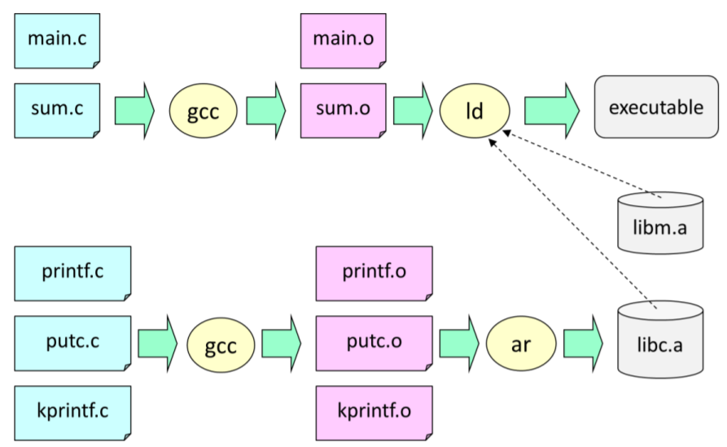

# GCC 開發環境

## 輸出 a.out

```
user@DESKTOP-96FRN6B MINGW64 /d/pmedia/陳鍾誠/課程/系統程式/02-gcc/00-hello (master)
$ gcc hello.c

user@DESKTOP-96FRN6B MINGW64 /d/pmedia/陳鍾誠/課程/系統程式/02-gcc/00-hello (master)
$ ./a.exe
hello!
```

## 使用 -o 參數

```
user@DESKTOP-96FRN6B MINGW64 /d/pmedia/陳鍾誠/課程/系統程式/02-gcc/00-hello (master)
$ gcc hello.c -o hello

user@DESKTOP-96FRN6B MINGW64 /d/pmedia/陳鍾誠/課程/系統程式/02-gcc/00-hello (master)
$ ./hello
hello!
```

## gcc 的使用流程



