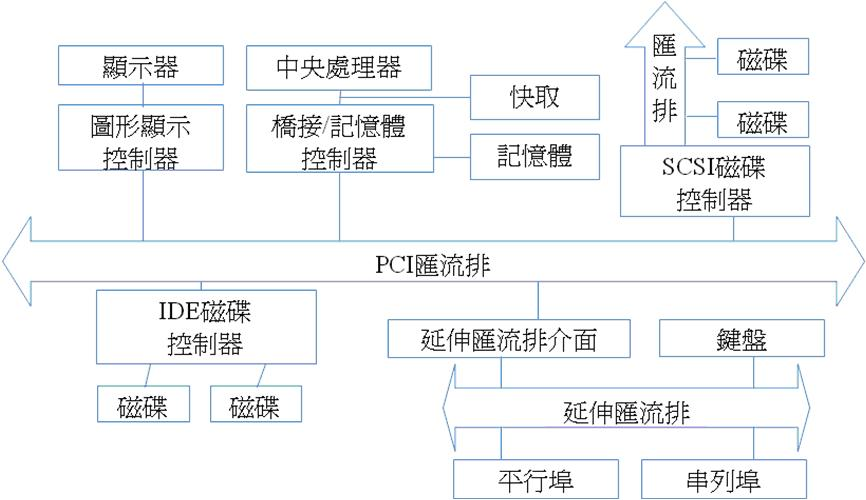
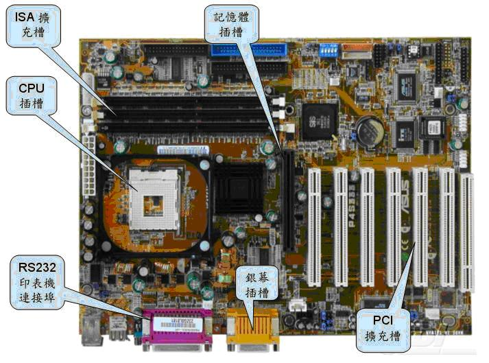
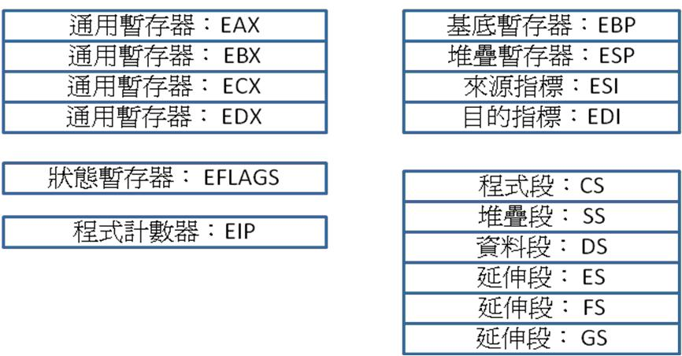
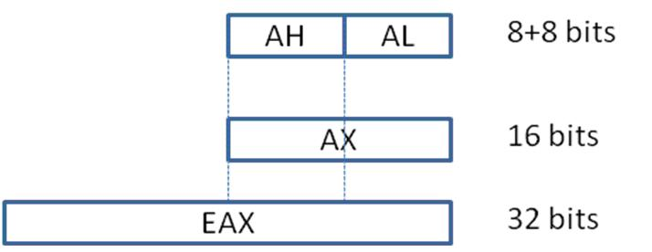

# 組合語言簡介

在電腦發展的早期，許多人都會使用組合語言撰寫程式。但在電腦發達的今天，組合語言通常只被用來撰寫非常低階的程式，像是啟動載入器、配置中斷向量、作業系統的行程切換、驅動程式、以及少數為了速度原因而採用組合語言的程式，例如像繪圖卡的顯示程式等。

雖然如此，學習組合語言的概念仍然有其重要性。因為組合語言除了是計算機結構的核心領域，可以幫助理解電腦的硬體架構之外，還可以幫助讀者學習系統軟體的設計方式，是理解系統軟體的捷徑。正因為如此，組合語言可以說是系統程式課程的核心。

## IBM PC 的硬體架構

## 參考文獻

* [x86 Instruction Set Reference](http://siyobik.info/index.php?module=x86)
* [The Intel 8086 / 8088/ 80186 / 80286 / 80386 / 80486 Instruction Set](http://home.comcast.net/~fbui/intel.html)
* Intel Architecture Software Developer's Manual - Volume 2
* <http://developer.intel.com/design/pentium/manuals/24319101.pdf>