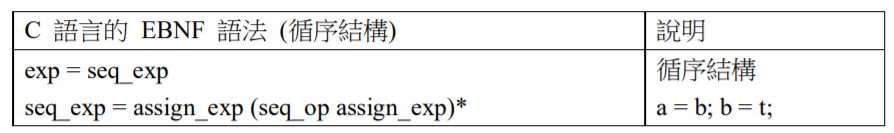

# C 語言的語法、語意與執行環境

1970 年 Dennis Ritchie 和 Ken Thompson 所設計出來的 C 語言，可以說是歷久彌新的語言，很少語言可以和 C 語言一樣，能夠經歷 40 年而仍然被廣泛使用
的。 1973 年，Unix 作業系統的核心正式用 C 語言改寫，從此奠定了 C 語言在系統程式上的地位。近代的作業系統，像是 Linux、FreeBSD、Mac OS X 等作業系統，都深受 Unix 的影響，這讓 C 語言成為系統程式中的尚方寶劍，Dennis Ritchie 和 Ken Thompson 也因 C/UNIX 而獲頒資訊科學界的諾貝爾獎 - 圖靈獎 (Turing Award)。

以下我們將利用 C 語言作為範例，分別解說語法、語意與執行平台的設計方式，讓讀者能夠實際感受高階語言的設計原理。

## C 語言的語法及語意

C 語言的語法基本上是遵循結構化程式語法的，包含『指定結構』、『運算結構』、『循序結構』、『分支結構』、『迴圈結構』、『函數結構』等。這些結構貫穿了整個
語法和語意層面，形成 C 語言的主要語言結構。

## 基本單元

C 語言的基本單元由下圖的基本算式 primary-exp 與後置算式 postfix_exp 所構成，像是 `x, 35, "hello! ", x[3], f(x), f(), rec.x, rec->x, x++, x-- `等，這兩個算式是所有結構的基礎，因此被我們稱為基本單元。

## 指定結構

C 語言指定結構的語法如下圖的 assign_exp 所示，像是 a=3*x 就是 C 語 言中的一個運算式，但必須注意的是，根據 ( var-ref assign-op ) cond-exp 這個
語法， a = b = 3*x 也是一個合法的運算式。

assign_op 並非只有等號，還可以加上某些前置運算符號，像是 +=, -=, *=, /=, %=, <<=, >>=, &=, ^=, |= 特殊型的指定運算，這二元運算 (+, -, *, /, %, <<, >>, &, ^, |) 中的變數將會被用來與 ssign_exp 中的結果進行運算，然後再將結果存回該變數中，舉例而言，像是 a += b 就代表了 a=a+b 的語意，這種表示法可以視為一種縮寫。

## 運算結構

C 語言的運算結構可分為邏輯運算、位元運算、關係運算、數學運算、單元運算等等，其語法如下圖所示。

數學運算結構從加減運算 `additive_exp` 開始，衍生出乘除運算的 `mult_exp`，舉例而言，在 `a * 3 + b[5]` 這個語句中，比對的情況會如 `additive_exp (a*3+b)` : `additive_exp (a*3) + mult_exp (b[5])` 算式所示，然後再經由 `additive_exp = mult_exp` 這個式子，透過 `mult_exp = mult_exp * cast_exp`，再進一步分化，最後會透過後置運算 `postfix_exp` 銜接上基本單元，因而導出像 `a, 3, b[5]` 這樣的基本元素。

## 循序結構

C 語言中的指定敘述，透過分號 “;” 串聯起來，形成循序結構，像是 `i=1; x=f(3); t=a; a=b; b=t;` 這樣連續的指定敘述，形成更大的單元，這些單元會一個接著一個執行，以下的 seq_exp 就是 C 語言循序結構的主要語法。

## 分支結構

C 語言包含 if 與 switch 等兩種分支指令，if 指令較為簡單，像是 if (i>0) x=i; 這樣的指令就是一個簡單的範例，if 指令還可以跟著 else，形成像 if(a>b) x=a;else x=b; 這樣的結構。而 switch 指令則用在多重分支結構上，像是 switch (c){ case 'a': x+=a; case 'b': x+=b; default: x+=c; } 這樣的範例，就是一個多重分支的例子。

## 迴圈結構

C 語言的迴圈結構包含 while, do while 與 for 迴圈等三種，所有迴圈結構都是透過某種判斷式 exp 決定是否要跳離迴圈，而其執行的內容則都是某種陳述式 stat。

## 函數結構

由於 C 語言是一種強型態 (Strong Typed) 的語言，所有的變數都必須宣告形態，而且又包含指標、陣列、函數指標等較為複雜的形態，因此其函數結構的語法相對複雜，以下是 C 語言函數相關的 EBNF 語法。

的 function_def 代表函數的定義，像是 static int f(n) int n; { return n * n; } 就是一個函數。其中的 static 是 decl 的部分，int 是 specs 的部分，而 f(n) 是 declarator，int n; 則是 decl_list，compound_stat 則比對到 { return n*n; } 區
塊。

declarator 代表函數的宣告部分，由於函數中的參又有可能是一個函數指標，因此 d_declarator 又可能會導回 ( declarator )，形成某種遞迴結構。

以上的 BNF 語法僅是 C 語言語法的一部分，並非全部的 EBNF 語法。在 C 語言當中還有關於資料結構的語法，像是 struct, union, enum 等，在此我們將不
詳述，有興趣者請參考下列網址。

* http://www.cs.man.ac.uk/~pjj/bnf/c_syntax.k_r

## C 語言的執行環境

C 語言通常採用編譯的方式，先將程式編譯為機器碼 (目的檔或執行檔)，然後才在目標平台上執行 C 語言。C 語言編譯後的機器碼通常是與平台相關的，是可以直接被 CPU 執行的二進位碼，因此速度非常的快，這也是 C 語言的優點之一。

C語言在執行時，通常會編譯為目的檔或執行檔的形式，這個些檔案包含程式段、資料段、BSS 段等區域，但在執行時還會多出堆疊 (Stack) 與堆積 (Heap) 等兩個區段。

在程式執行的過程中，經常會需要取得某些記憶空間，以便儲存電腦運算過程中所產生的資料，程式中的資料通常被放在兩個記憶體區塊中，一個稱為堆疊區(Stack)，一個稱為堆積區 (Heap)。

堆疊段與堆積段的成長方向是相反的，假如堆積由上往下成長，堆疊段的成長方向就會是由下往上。堆疊與堆積兩段共用同一塊記憶體空間，但是起始點與成長方向完全相反。

編譯器會將副程式的參數、區域變數與返回點等資訊會被推入堆疊中，並且會從堆疊中分配空間給區域變數使用。堆疊的記憶體的配置並不困難，當需要記憶體時，一定是從堆疊的最上層開始分配，編譯器只要根據變數的型態與數量，決定配置空間的大小即可。

堆積區的記憶體使用方法就較為複雜了，在 C 語言當中，malloc() 函數是主要的記憶體請求指令，這種指令通常被稱為動態記憶體 (Dynamic Allocation) 配置請求，因為 malloc() 函數會在執行的過程當中，動態的取得足夠的記憶體空間，以便分配給程式使用。

記憶體配置函數 malloc() 會從堆積段當中分配一塊記憶體後傳回其指標，於是呼叫端的程式就可以利用這個指標進行資料存取。但是，由於 malloc() 會導致堆積區的成長，而函數呼叫則會導致堆疊段的成長，如果兩個區域成長過頭而導致重疊的情況，就會相互覆蓋而導致資料破壞的情況。這對程式設計人員而言是一種很難處理的錯誤，最好能設計其錯誤處理機制以防止此種情況。

因此、C 語言的程式設計師必須在使用完 malloc() 所分配的記憶體後，盡快的利用 free() 函數以歸還記憶體給堆積區，這樣才能避免堆疊溢出 (或堆積溢出)的情況，讓程式能在堆積尚未溢出之前完成。但是如果所有堆積空間不足，而且沒有任何的『未分配記憶體區塊』可以滿足記憶體分配的請求時，程式仍然會被迫停止，或者進入不可預知的錯誤狀況。

## 使用框架存取參數與區域變數

當 C 語言的函數想要存取參數或區域變數時，通常不能透過變數名稱存取這些變數，否則就不能支援遞迴呼叫了。因為在遞迴呼叫的過程中，參數名稱與區域變數的名稱雖然相同，但是不同層次的遞迴所『看見的』變數內容是不同的。

換句話說，當我們將 C 語言程式轉換為組合語言時，不能將參數與區域變數轉換為組合語言中的標記，而必須轉換為堆疊區域的存取指令。

一個函數的參數與區域變數所形成的堆疊區塊，通常稱之為框架 (Frame)，為了要存取這個框架，我們可以設定一個框架暫存器 (Frame Pointer, FP)，然後使用相對定址的方式存取這些變數。

## 參考文獻

* https://www.geeksforgeeks.org/memory-layout-of-c-program/
