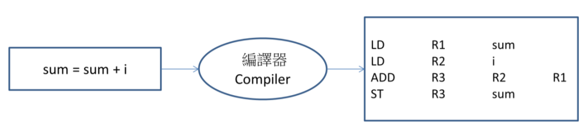
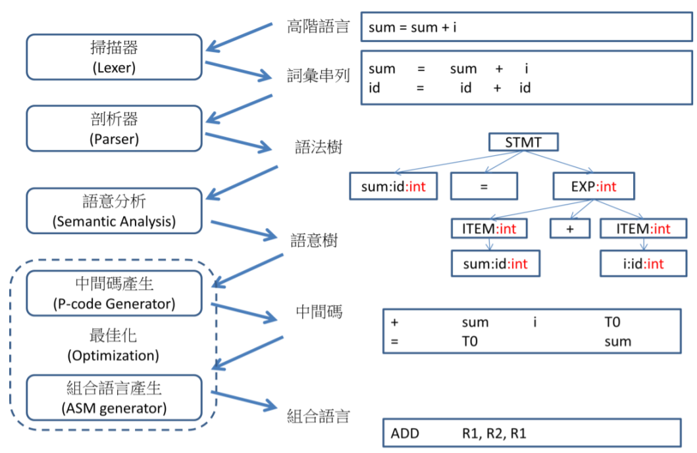

# 編譯器簡介

編譯器是用來將高階語言轉換成組合語言 (或者是機器碼) 的工具程式。有了編譯器或直譯器，程式設計師才能用高階語言撰寫程式。因此，編譯器是程式設計師的重要工具，也是系統程式課程的重點之一。

下圖顯示了一個編譯器的基本功能，在該圖中，像 sum=sum+i 這樣的高階語言指令，輸入到編譯器之後，會被轉換成一連串的組合語言指令，然後，這些組合語言指令再度被組譯器轉換成機器碼，成為執行檔以便在目標機器上執行。



以下是一個更完整的例子：

```cpp
sum = 0;
for (i=1; i<=10; i++)
{
 sum = sum + i;
}
return sum;
```

我們可以使用下列的 [EBNF](https://en.wikipedia.org/wiki/Extended_Backus%E2%80%93Naur_form) 語法描述這樣的程式語言。

```BNF
PROG = BaseList
BaseList = (BASE)*
BASE = FOR | STMT ';'
FOR = 'for' '(' STMT ';' COND ';' STMT ')' BLOCK
STMT = 'return' id | id '=' EXP | id ('++'|'--')
BLOCK = '{' BaseList '}'
EXP = ITEM ([+-*/] ITEM)?
COND = EXP ('=='|'!='|'<='|'>='|'<'|'>') EXP
ITEM = id | number
id = [A-Za-z_][A-Za-z0-9_]*
number = [0-9]+
```

在上述的規則中，星號 * 代表重複零次以上，加號代表重複一次以上，因此，第 7 條的 BaseList = (BASE)* 代表 BaseList 可以由許多個 BASE 所組成(包含零
次)，而第 11 條的 number = [0-9]+ 代表 number 由 0,1,2,3,4,5,6,7,8,9 等數字重複一次以上所組成的。

如果規則中的一個 (…) 區塊或 […] 區塊後面跟著問號 ?，那麼就代表該區塊可以出現零次或一次，例如在第 7 條的 EXP = ITEM ([+-*/] ITEM)? 當中的問號，代
表 ([+-*/] ITEM) 這個區塊可以出現零次或一次，也就是 EXP = ITEM 或 EXP =ITEM [+-*/] ITEM 都是符合語法的語句。

假如規則中的 (…) 或 […] 區塊後沒有跟著任何符號，那麼就代表該區塊只能出現一次，舉例而言，在第 8 條的 COND = EXP ('=='|'!='|'<='|'>='|'<'|'>') EXP 當中，代表 ('=='|'!='|'<='|'>='|'<'|'>') 這個區塊只能出現一次，而其中的直線符號 | 代表或者的意思，該語句的意義是 '=='、'!='、'<='、'>='、'<'、'>' 這些符號其中的一個會出現一次。

第 4 條的 FOR 規則是整個語法中最複雜的一條，其中包含三個重要的部分，也就是 STMT、COND 與 BLOCK 等三者，STMT 用來描述 i=0; i++ 等敘述，而 COND
則描述條件判斷部分，像是 i<=10 等，而最後的 BLOCK 則是 for 迴圈的主體部分，BLOCK 乃是由一對大括號 {..} 夾住的 BaseList 區段所組成，BLOCK 透過
BaseList 會回到 BASE，於是又遞迴的定義了下一層的程式區段。

因此， 上述的 EBNF 規則實際上已經定義了多層的 for 結構語法，所以可以透過下列的生成方式可以產生多層次的 FOR 語句。

PROG=>BASE=>FOR=>BLOCK=>BaseList=>BASE=>FOR=>BLOCK=>BaseList=>BASE=>STMT …

## 編譯器的六大階段

編譯的步驟可以細分為六大階段，分別是詞彙掃描、語法剖析、語意分析、中間碼產生，最佳化、組合語言產生等六大階段，下圖顯示了這六大階段的輸入與輸出，這個圖非常的重要，請讀者務必仔細觀察其輸入與輸出，以便理解每一個階段的功能。



在第一階段當中，高階語言的程式碼，像是圖 8.3 中的 sum = sum + i 這個語句，會被輸入到掃描器 (Lexer 或 Scanner) 當中，掃描器會將整個程式分成一個一個
的基本詞彙 (token)，並為每個詞彙標註型態，於是會輸出 (sum:id) (=) (sum:id) (+) (i:id) 這樣的詞彙串列。

接著，這個詞彙串列成為剖析器 (Parser) 的輸入，剖析器利用語法規則進行比對，以逐步建立語法樹，直到整個程式成為一棵完整的大樹為止，於是 sum = sum
+ i 這個語句將會形成圖 8.3 中的語法樹 (Abstract Syntax Tree)。

在語意分析 (Semantic Analysis) 階段，編譯器會為這個語法樹加註節點型態，並檢查這些型態是否相容，然後輸出語意樹，在圖 8.3 的語法樹中，sum、i、ITEM、
EXP 等節點，就是在語意分析階段被加註了 int 型態，於是形成了具有語意標記的語法樹 (Annotated Abstract Syntax Tree)，或稱為語意樹 (Semantic Tree)。

接著，在中間碼產生階段，語意樹被轉換成一種平坦的結構，這種結構很像組合語言，但卻又不是特定機器的組合語言，這種結構被稱為中間碼 p-code (Pseudo
Code)。

中間碼是一種『與機器結構無關的組合語言』，像是 Java 的 bytecode，就是一種廣為人知的中間碼。在中間碼的指令中，通常沒有暫存器的概念，因此所有運
算可以直接對變數進行，而不需要考慮暫存器配置的問題。


接著，我們就可以將中間碼轉換為組合語言，在轉換時必須考慮暫存器的配置問題，以及程式的效率問題，因此，編譯器通常會進行某些最佳化的動作之後，才將中間碼轉換為組合語言輸出。

舉例而言，上圖中的 + sum i T0 與 = T0 sum; 等兩行中間碼，被轉換為組合語言時竟然只剩下一行 ADD R1, R2, R1 的指令，這是由於前面的程式已經將 sum, i 等變數載入到暫存器 R1, R2 當中，因此最佳化後的程式才能直接對 R1, R2 進行加法動作，否則的話，這兩行中間碼應該會轉換成將近十行的組合語言才對。
