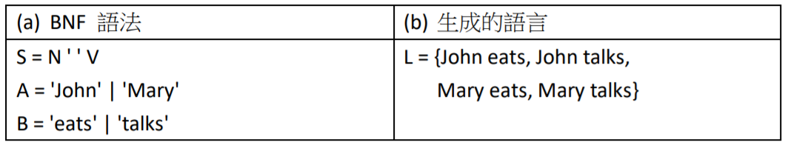

# 編譯器設計

編譯器是將高階語言轉換為《組合語言或可執行檔》的工具，如運作流程下圖所示：


## gcc 編譯器

舉例而言，我們可以使用 gcc 將 c 語言程式編譯為執行檔，然後執行之，例如：

```
PS D:\ccc\course\sp\code\c\01-gcc\01-toolchain> gcc sum.c -o sum
PS D:\ccc\course\sp\code\c\01-gcc\01-toolchain> ls


    目錄: D:\ccc\course\sp\code\c\01-gcc\01-toolchain


Mode                LastWriteTime         Length Name
----                -------------         ------ ----
-a----      2019/8/30  上午 10:59           2094 README.md
-a----      2019/8/30  上午 10:59            182 sum.c
-a----       2020/3/1  下午 05:22          27948 sum.exe
-a----      2019/8/30  上午 10:59           1558 sum.s


PS D:\ccc\course\sp\code\c\01-gcc\01-toolchain> ./sum.exe
sum(10)=55
PS D:\ccc\course\sp\code\c\01-gcc\01-toolchain> ./sum    
sum(10)=55
```

您可以看到在 gcc sum.c -o sum 這個指令執行完之後，產生了 sum.exe 這個執行檔，然後當我們用 ./sum 這個指令之後，看到 sum.exe 被執行並輸出了 sum(10)=55 這樣的結果。

更多的範例與執行方法請看 github 專案:

* https://github.com/ccccourse/sp/tree/master/code/c/01-gcc

## 生成語法

想要理解編譯器是如何設計的，必須先理解何謂《生成語法》。


舉例而言，假如我們有個生成語法如下，

```
S = N V
N = cat | dog
V = run | eat
```

那麼透過 N => dog , V=> run 就可以產生 dog run 這樣的句子。

如果強化一下語法，那麼就可以生成更完整的語句。


如果繼續強化語法




那麼就可以描述更複雜的英文語句了


## 運算式編譯器

對於數學運算式，我們也可以用下列語法描述：

```
E=F ([+-] F)*
F=Number | '(' E ')'
```

然後根據這個生成語法，我們寫出了以下的《運算式編譯器》


* https://github.com/ccccourse/sp/tree/master/code/c/02-compiler/00-exp0


```
PS D:\ccc\course\sp\code\c\02-compiler\00-exp0> gcc exp0.c -o exp0

PS PS D:\ccc\course\sp\code\c\02-compiler\00-exp0> ./exp0 '3+5'      
argv[0]=D:\ccc\course\sp\code\c\02-compiler\00-exp0\exp0.exe argv[1]=3+5      
=== EBNF Grammar =====
E=F ([+-] F)*
F=Number | '(' E ')'
==== parse:3+5 ========
t0=3
t1=5
t2=t0+t1

PS D:\ccc\course\sp\code\c\02-compiler\00-exp0> ./exp0 '3+(5-2)'
argv[0]=D:\ccc\course\sp\code\c\02-compiler\00-exp0\exp0.exe argv[1]=3+(5-2)  
=== EBNF Grammar =====
E=F ([+-] F)*
F=Number | '(' E ')'
==== parse:3+(5-2) ========
t0=3
t1=5
t2=2
t3=t1-t2
t4=t0+t3

PS D:\ccc\course\sp\code\c\02-compiler\00-exp0> ./exp0 '(3+5)-2' 
argv[0]=D:\ccc\course\sp\code\c\02-compiler\00-exp0\exp0.exe argv[1]=(3+5)-2  
=== EBNF Grammar =====
E=F ([+-] F)*
F=Number | '(' E ')'
==== parse:(3+5)-2 ========
t0=3
t1=5
t2=t0+t1
t3=2
t4=t2-t3
```

上述編譯器產生的是《中間碼》，而不是《特定處理器的組合語言》，真正的編譯器通常會產生《組合語言或機器碼》。

在以下範例中，我們加入了將中間碼轉換為組合語言的動作，產生了 nand2tetris 課程中的 HackCPU 組合語言。

```
$ gcc exp0hack.c -o exp0hack
$ ./exp0hack '3+(5-8)'
=== EBNF Grammar =====
E=F ([+-] F)*
F=Number | '(' E ')'
==== parse:3+(5-8) ========
# t0=3
@3
D=A
@t0
M=D
# t1=5
@5
D=A
@t1
M=D
# t2=8
@8
D=A
@t2
M=D
# t3=t1-t2
@t1
D=M
@t2
D=D-M
@t3
M=D
# t4=t0+t3
@t0
D=M
@t3
D=D+M
@t4
M=D
```

## 詞彙掃描程式

為了降低學習門檻，上述運算式編譯器只能處理數字運算，不能使用變數，也沒有迴圈等控制結構。

還有，該程式沒有詞彙解析功能，只能處理 0-9 的數字，不能處理像 37 或 173 這樣多的字元的數字。

為了可以處理《變數，多字元數字或關鍵字》，我們需要建立一個《詞彙掃描程式》。

以下是一個簡易的詞彙掃描程式。

* https://github.com/ccccourse/sp/blob/master/code/c/02-compiler/02-lexer/lexer.c

## 微型編譯器

有了詞彙掃描程式後，我們就可以使用更複雜的詞彙，結合前述的生成語法，就能建構出《微型編譯器》了！

* https://github.com/ccccourse/sp/tree/master/code/c/02-compiler/03-compiler

我們可以用 make 指令建置該程式

```
PS D:\ccc\course\sp\code\c\02-compiler\03-compiler> make
gcc -std=c99 -O0 lexer.c compiler.c main.c -o compiler
```

該微型編譯器使用下列語法

```
PROG = STMTS
BLOCK = { STMTS }
STMTS = STMT*
STMT = WHILE | BLOCK | ASSIGN
WHILE = while (E) STMT
ASSIGN = id '=' E;
E = F (op E)*
F = (E) | Number | Id
```

然後我們就可以寫個範例程式如下:

* https://github.com/ccccourse/sp/blob/master/code/c/02-compiler/03-compiler/test/sum.c

```
s=0;
i=1;
while (i < 11) {
  s = s + i;
  i = i + 1;
}
```

接著用該編譯器《編譯範例程式》，得到下列結果：

```
PS D:\ccc\course\sp\code\c\02-compiler\03-compiler> ./compiler test/sum.c     

s=0;
i=1;
while (i < 11) {
  s = s + i;
  i = i + 1;
}


========== lex ==============
token=s
token==
token=0
token=;
token=i
token==
token=1
token=;
token=while
token=(
token=i
token=<
token=11
token=)
token={
token=s
token==
token=s
token=+
token=i
token=;
token=i
token==
token=i
token=+
token=1
token=;
token=}
========== dump ==============
0:s
1:=
2:0
3:;
4:i
5:=
6:1
7:;
8:while
9:(
10:i
11:<
12:11
13:)
14:{
15:s
16:=
17:s
18:+
19:i
20:;
21:i
22:=
23:i
24:+
25:1
26:;
27:}
============ parse =============
t0 = 0
s = t0
t1 = 1
i = t1
(L0)
t2 = i
t3 = 11
t4 = t2 < t3
if not T4 goto L1
t5 = s
t6 = i
t7 = t5 + t6
s = t7
t8 = i
t9 = 1
t10 = t8 + t9
i = t10
goto L0
(L1)
```

這樣我們就完成了一個小型編譯器了！

