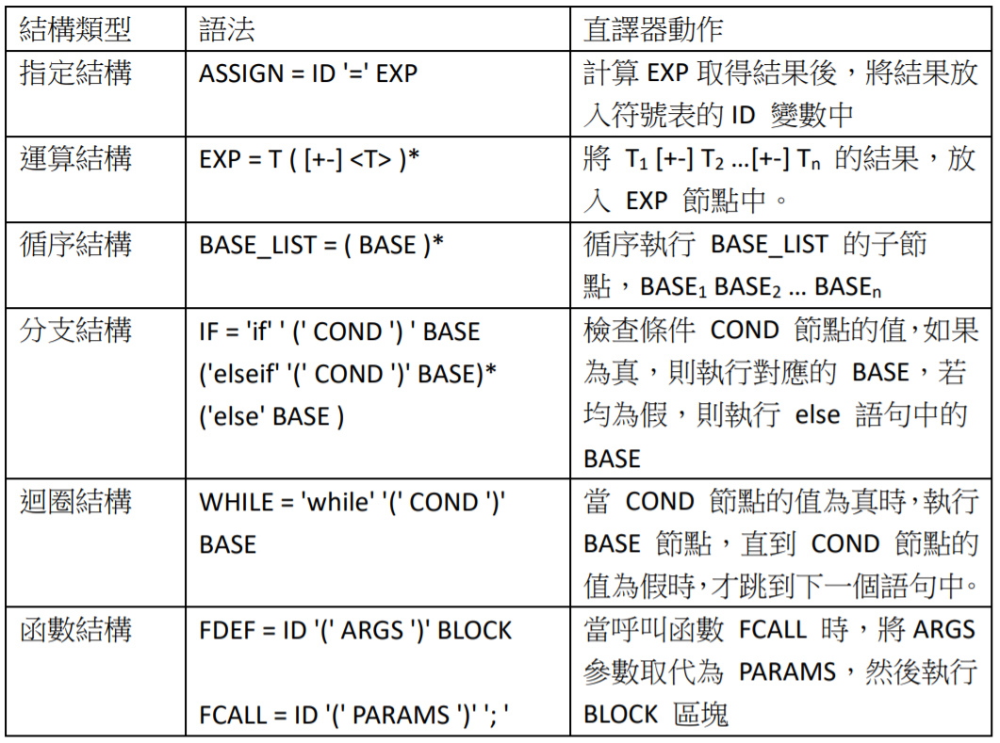

# 語意理論

語意理論所探討的是語法所代表的意義，也就是某個語法應該如何被執行，或者如何轉換成組合語言的問題。在本節中，我們將專注在結構化程式語言 (像是 C 語言) 的語意問題上，而不去探討其他種類的語言，像是 Prolog 等語言的語意上。

## 結構化的語意

目前產業界的主流語言是結構化語言，像是 C 語言就是典型的結構化語言，但是自從物件導向技術盛行以來，結構化語言都被加上了物件導向的語法，像是C++、C#、 Java、Obj C 等語言，都是將 C 語言加上物件導向功能後的結果。

結構化語言的主要結構有六種，包含『指定、運算、循序、分支、迴圈、函數』等語法，表格 7.1 顯示了結構化程式的構造方式，讓我們來看看這些結構所隱含的語意。

指定結構的語法是 ID '=' EXP，其意義乃是將 EXP 的運算結果傳送給變數 ID，於是，ID 變數將會設定為 EXP 的結果。舉例而言，指定敘述 `x = 3*y+5` 會將 `3*y+5` 的結果傳送給 x，假如 y 的值為 4，則執行完後 x 的值將變成 17。

運算結構的語法是從數學中借用過來的，其語意正是數學中的加減乘除之語意，舉例而言，規則 `EXP = T ([+-] T)*` 定義了加減的語法，而其語意則是將 T+T 或
T-T 的結果傳回。

循序結構的語法是 BASE_LIST = ( BASE )*，這代表 BASE 可以連續出現很多次，其意義是循序的執行每個 BASE，例如像 t=a; a=b; b=t; 這樣的語句，其意義是t=a 執行完後，接著執行 a=b，然後再執行 b=t。

分支結構可以用 IF = 'if' ' (' COND ') ' BASE ('elseif' '(' COND ')' BASE)* ('else' BASE )
這樣的語法表示，其意義是當條件 COND 成立時，就執行對應的 BASE ，如果都不成立，則執行最後的 else 語句。例如像 if (a>b) c=a; else c=b; 這樣的語句，
其意義是當 a>b 條件成立時，就執行 c=a，否則，就執行 else 中的敘述 c=b。

迴圈結構通常有 for 迴圈與 while 迴圈，在此我們以 while 迴圈為例，while 迴圈的語法為 WHILE = 'while' '(' COND ')' BASE，其意義是當是當 COND 條件成立時，就繼續執行 BASE 節點，直到 COND 條件不成立才離開迴圈。例如，while(i<=10) { sum = sum+i; i++;} 這樣的語句，在 i<=10 時，會執行 { sum = sum +i; i++; }區塊，直到 i 大於 10 為止。

函數的語法分為定義與呼叫等兩部分，函數可用 FDEF = ID '(' ARGS ')' BLOCK 的方式定義，其中的 ID 代表函數名稱，ARGS 是參數串列，而 BLOCK 則是函數的
內容區塊。舉例而言，像是 max(a,b) { if (a>b) return a; else return b;} 這樣一個函數定義，其中的函數名稱 ID=max，參數串列 ARGS = a,b，而內容區塊 BLOCK = { if (a>b) return a; else return b;}。

函數呼叫的語法為 FCALL = ID '(' PARAMS ')' '; '，其中的 ID 部分為函數名稱，PARAMS 部分則為參數串列。舉例而言，在函數呼叫 max(3,5) 當中，函數名稱
ID=max，參數串列 PARAMS = 3,5。

函數的定義與呼叫兩者，形成了一組『呼叫者/被呼叫者』的語意，舉例而言，max(3,5) 這個語句，與 max(a,b) {…} 這個函數，形成了一組對應關係。語句max(3,5) 代表將 3 傳給 a, 5 傳給 b，呼叫時會將 PARAMS 當中的引數，傳遞給ARGS 當中的參數，形成一對一的關係。

上述的『指定、運算、循序、分支、迴圈、函數』等六種語意結構，是結構化程式的基本語意，現今的大部分的程式語言都具備這些結構，而這也六種語意也正好對應到 C 語言中最重要的六種基本語法。

## 執行環境

即使有了語法及語意，我們仍然需要將程式語言放入真實的電腦當中，才能夠真正執行。目前常見的執行的環境，大致上可以分為直譯環境 (本節) 和編譯環境 兩類，其中的編譯環境又可進一步細分為三種，一種是在虛擬機器上
執行，一種是在有作業系統的環境中執行，另一種是在沒
有作業系統的嵌入式環境中執行。

以下，我們將大略的介紹這些執行環境，以便作為後續章節的基礎，首先，讓我們來看看第一種的直譯式環境，也就是透過直譯器執行的方式。

透過直譯器執行直譯器是一種可以直接執行高階語言的系統程式，通常在直譯器當中會包含一個剖析器，將高階語言先轉換成語法樹之後，才開始執行這棵語法樹。

當語法剖析的階段完成後，就可以透過直譯器解譯該語法樹，實作前述的語意理論。這種方法是利用直譯器建構出一個模仿語意理論的環境，然後利用直譯器的動作，模擬出對應的操作語意。

在上一節的語意理論中，我們曾經看過結構化程式語言的六種語法及語意，現在，我們就針對這六種結構，說明其直譯動作的實作方式，下表顯示了這六種結構所對應到的直譯器動作。

