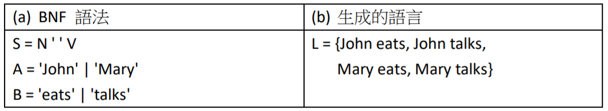

## 高階語言的語法

高階語言的設計一直是程式設計人員關注的焦點，從 1960 年代以來，人們不斷發明新的程式語言，然而，這些語言就好像流行服飾一般，不斷的推陳出新，這使得目前已知的程式語言達數百種之多，沒有任何人能熟悉所有的高階程式語言。

為了說明常見的高階語言之間的關係，我們在圖 7.1 當中列出了高階語言的發展歷史年表，以便讓讀者對現今的高階語言能有一個整體性的概念。

程式語言的多樣性對程式設計師而言往往是一大困擾，每一種語言通常在特定領域擁有一群支持該語言的程式設計團體，同時也伴隨著一些程式開發工具。這也造成了程式開發工具的多樣性。多年來，一直有人試圖創造最佳的通用程式語言，但最後都只造成了程式語言更為多樣。或許，這樣的狀況會一直持續下去，程式設計師仍然必須隨時準備學習新語言。

在資訊系的相關課程當中，與高階語言相關的課程，包含程式語言 (Programming Language)、正規語言 (Formal Language)、以及編譯器 (Compiler) 等等。這些課程的核心是語法理論，我們可以利用生成規則 (例如：BNF, EBNF 等) 描述程式的語法。一但能正確的描述某個程式語言，就能撰寫該語言的剖析程式，將這些語法轉換成語法樹 (或稱剖析樹)。

一但語法樹建構完成，就可以進行『解譯』或『編譯』的動作。如果我們撰寫程式以解讀該語法樹，並根據節點類型執行對應的動作，這樣的程式就被稱為『直譯器』。但是，如果我們撰寫程式將語法樹轉換為組合語言 (或目的碼)，那麼，這樣的程式就被稱為編譯器。

## 語法理論

高階語言所使用的語法，大致上分為兩個層次，在詞彙的語法上會使用 Regular Expression (簡稱 RE)，而語句的層次則使用 Context-Free Grammar (簡稱 CFG) 表
示，在 RE 與 CFG 等兩個層次都可以使用『生成規則』描述其語法。

『生成規則』是近代語言學之父的喬姆斯基 (Chomsky) 的所提出的一種語法規則，是生成語法 (Generative Grammar) 理論的基礎，生成語法理論在近代語言學當中具有非常重要的地位，可以說是語言學當中最重要的理論之一。

Chomsky 是個語言學家，提出的生成語法的目的是為了描述人類所說的語言，像是英文、中文等，這種人類所說的語言被稱為『自然語言』(Natural Language)，以便與程式語言 (Programming Langauge) 區分開來。

雖然生成語法是為了描述自然語言而提出的，但是也可以用來描述程式語言的語法，在程式語言的領域，這些生成規則通常被寫成 BNF (Backus–Naur Form) 規則。

BNF 是由 John Backus 與 Peter Naur 所提出的一種規則寫法，這種寫法很適合用來描述程式語言的語法，BNF 的發明人幾乎與 Chomsky 同時發明了生成語法，
只是一個在屬於電腦領域，一個屬於語言學領域而已。

我們可以利用少許的 BNF 規則，就能描述變化無窮的語句結構，這種化繁為簡能力，是語法理論的精隨所在。BNF 規則可以適用『程式語言』領域，完完全全的描述整個語言的語法，甚至可以適用在『自然語言』上，但是通常無法完全掌握像英文與中文這樣的語言結構。

為了學習 BNF 語法規則，首先讓我們來看看一個極為簡易的語法，如下圖所示，其中的 a,b,c,d 等稱為終端符號，而 S, A, B 等稱為非終端符號。

在生成語法規則當中，等號左邊的符號可以被代換成右邊的符號，上述規則當中的 S = A B 代表 S 符號可以被代換成 A 與 B 的連接，而 A = 'a' | 'b' 則代表 A
符號可以被代換成 a 或 b 字元。於是，若我們選定 S 為起始符號，則由 S 所可能導出的字串就有 L = {ac, ad, bc, bd } 等四種可能性，於是我們稱 L 為這組語
法所代表的語言 (Language)。

對於上圖所描述的範例，可能較難讓讀者聯想到真正的語言上，為了讓讀者能理解 BNF 語法的意義，我們將圖中的符號名稱與內容改變，但是規則的形式不變，得到如下語法。

S 代表句子 (Sentence)，N 代表名詞 (Noun)，V 代表動詞 (Verb)。於是，從 S 符號可以導出 John eats, John talks, Mary eats, Mary talks 等四個英文語句，這也就是當初 Chomsky 發明生成語法的主要目的，描述英文並說明語言的組成方法。

在程式語言當中，表達數學運算式是很重要的能力，以下，就讓我們來看看數學運算式的 BNF 規則，以便進一步說明程式和語法規則之間的關係。

數學運算式乃是數字與加減乘除符號的組合，例如，在 3+5*8-4/6 這個運算式中，就包含了許多數字與符號，其中的符號可能是加減乘除等四種，下圖顯示了一組很簡單的數學運算式語法規則。

符號 N 代表整數，N = [0-9]+ 這一個規則可以用來表示所有的整數字串。其中，括號所框住的部分是候選字詞，因此 [0-9] 代表字元 0, 1, 2, 3, 4, 5, 6, 7, 8, 9 等字元，而加號 + 代表的是這些字元會出現一次以上 (包含一次)。

符號 E 代表數學運算式，E = N | E [+-*/] E 這樣的語法規則代表了一個數學式可以由單一的整數構成，也可以由兩個運算式透過[+-*/] 符號連接而成，其中的直線符號 | 代表『或者』的意思。

雖然上圖的語法雖然可以產生許多數學運算式，但是，若要作為程式語言的語法，用來製作編譯器，那就會產生相當大的問題。因為該語法具有歧義性 (Ambiguous)，也就是同一個運算式可能會被剖析為不同的語法樹。

舉例而言，對於 3-1-2 這個運算式而言，根據上述語法，可以生成下圖兩棵樹狀結構，其中(a) 是 (3-1)-2 的語法樹，而圖 (b) 則代表3-(1-2) 的語法樹。

這兩棵語法樹的運算順序不同，導致兩棵樹的運算結果也不相同，在 (a) 當中，(3-1) - 2 的運算結果為 0，但是在 (b) 當中，3-(1-2) 的運算結果卻是 4。

這樣的特性稱為語法的歧義性，也就是該語法會導出不同的語法樹，而且這些語法樹將代表不同意義。

程式語言的語法是不能有歧義性的，否則，程式編譯後有時 3-1-2 會計算出 0，有時卻會算出 4，這樣將導致程式設計師無法確定程式的執行結果，而陷入混亂崩潰的狀況。

下圖顯示了該語法的一個修正版本，這個版本雖然較為複雜，但是並沒有歧義性的問題。

上述語法透過巧妙的規則設計方式，讓乘除運算的優先順序比加減運算高，並且加入了 '(' E ') ' 這個語法，讓我們可以用括號強制某些運算優先執行。

我們可以導出 1+2*3 的唯一語法樹如下圖所示。由於該語法樹是唯一符合規則的語法樹，因此不會導致歧義性的問題。

但是上述語法有一個難以處理的『左遞迴』問題。像是 E = E [+-] T 與 T = T [*/] F 這樣的語法，都包含了『左遞迴』結構。當等號左邊的非終端符號 (E, T)，在同一條規則當中也出現在等號右邊的第一個位置時，就導致了左遞迴的語法。

在編譯器的設計上，左遞迴是相當難以處理的，還好，Pascal 語言的發明人Nicklaus Wirth 發明了一種 BNF 的延伸語法，稱為 EBNF (Extended Backus–Naur
Form) 語法可以處理左遞迴問題。EBNF 可以用來消除大部分的左遞迴，其方法是加入『迴圈語法』用以表示出現數次的意思。

在本文中，我們用 (…)* 符號，代表 … 部分重複比對，其中的星號 * 代表出現零次以上，現就像先前圖 7.6 中的加號 […]+ 代表出現一次以上一樣。另外，如果在規則中出現 (…)? 這樣的語法，代表 … 的部分會出現最多一次 (也就是0 次或者 1 次)。

我們可以利用 ()* 符號將上述具有左遞迴的語法，修改為以下沒有左遞迴的語法，這種用重複符號方式取代左遞迴的語法，就是 EBNF 語法。

現在，我們已經具備了足夠的語法理論基礎了，但是語法理論只能讓我們將程式轉換成語法樹，卻沒有告訴我們應該如何解讀這棵語法樹，因此我們需要語意理論，以便解讀語法樹，讓程式真正能夠執行。
