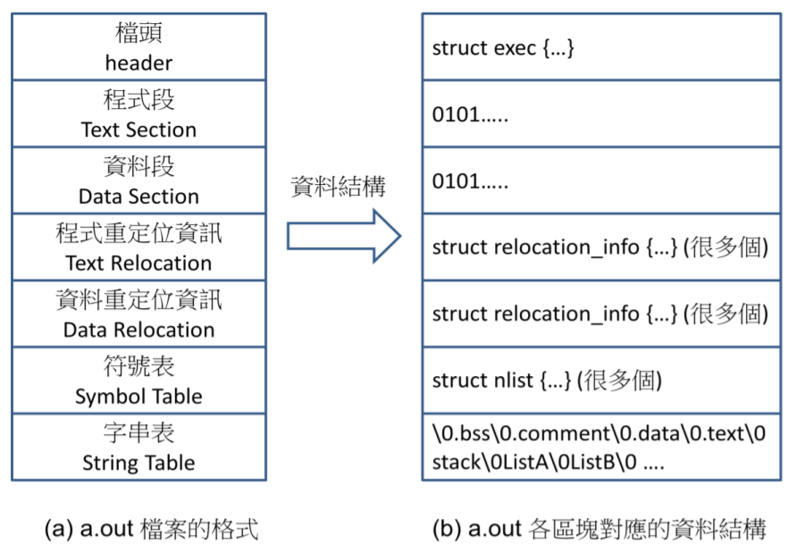
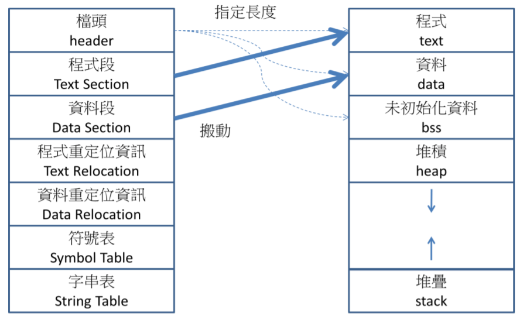

# 目的檔格式 – a.out

真正的目的檔，為了效能的緣故，通常不會儲存為文字格式，而是儲存為二進位格式。像是 DOS 當中的 .com 檔案，Windows 當中的 .exe 檔案，與 Linux 早期的 a.out 格式，還有近期的 ELF 格式，都是常見的目的檔格式。

為了讓讀者更清楚目的檔的格式，在本節中，我們將以 Linux 早期使用的 a.out 這個格式作為範例，以便詳細說明目的檔的格式。



早期的 Linux 採用的是較簡單的目的檔格式 a.out。這是由於 UNIX 與 Linux 的預設編譯執行檔名稱為 a.out 的原因。上圖顯示了 a.out 檔案中的區段，以及各區段的資料結構。

目的檔 a.out 的格式相當簡單，總共分為 7 個段落，包含三種主要的資料結構，也就是 1. 檔頭結構 (exec)、2. 重定位結構 (relocation_info)、3. 字串表結構(nlist)。這三個結構的定義如下圖所示。

```cpp
struct exec { // a.out 的檔頭結構
 unsigned long a_magic; // 執行檔魔數
// OMAGIC:0407, NMAGIC:0410,ZMAGIC:0413
 unsigned a_text; // 內文段長度
 unsigned a_data; // 資料段長度
 unsigned a_bss; // 檔案中的未初始化資料區長度
 unsigned a_syms; // 檔案中的符號表長度
 unsigned a_entry; // 執行起始位址
 unsigned a_trsize; // 程式重定位資訊長度
 unsigned a_drsize; // 資料重定位資訊長度
};

struct relocation_info { // a.out 的重定位結構
 int r_address; // 段內需要重定位的位址
 unsigned int r_symbolnum:24; // r_extern=1 時:符號的序號值,
// r_extern=0 時:段內需要重定位的位址
 unsigned int r_pcrel:1; // PC 相關旗標？？是「相對」吧？？
 unsigned int r_length:2; // 被重定位的欄位長度 (2 的次方)
// 2^0=1,2^1=2,2^2=4,2^3=8 bytes)。
 unsigned int r_extern:1; // 外部引用旗標。 1-以外部符號重定位
// 0-以段的地址重定位。
 unsigned int r_pad:4; // 最後補滿的 4 個位元 (沒有使用到的部分)。
};
struct nlist { // a.out 的符號表結構
 union { //
 char *n_name; // 字串指標，
struct nlist *n_next; // 或者是指向另一個符號項結構的指標，
long n_strx; // 或者是符號名稱在字串表中的位元組偏移值。
 } n_un; //
 unsigned char n_type; // 符號類型 N_ABS/N_TEXT/N_DATA/N_BSS 等。
 char n_other; // 通常不用
 short n_desc; // 保留給除錯程式用
 unsigned long n_value; // 含有符號的值，對於代碼、資料和 BSS 符號，
// 通常是一個位址。
};

```

讀者應該能很容易的看出『檔頭部分』使用的是 exec 結構。『程式碼部分』與『資料部分』則直接存放二進位目的碼，不需定義特殊的資料結構。而在『程式碼重定位的部分』與『資料重定位的部分』，使用的是 relocation_info 的結構。最後，在『符號表』的部分，使用的是 nlist 的結構。而『字串表』部分則直接使用了 C語言以 '\0' 為結尾的字串結構 
當 a.out 檔案被載入時，載入器首先會讀取檔頭部分，接著根據檔頭保留適當的大小的記憶體空間 (包含內文段、資料段、BSS 段、堆疊段、堆積段等)。然後，載入器會讀取內文段與資料段的目的碼，放入對應的記憶體中。接著，利用重定
位資訊修改對應的記憶體資料。最後，才把程式計數器設定為 exec.a_entry 所對應的位址，開始執行該程式，下圖 顯示了 a.out 檔被載入的過程。



目的檔格式 a.out 是一種比較簡單而直接的格式，但其缺點是格式太過固定，因此無法支援較為進階的功能，像是動態連結與載入等。目前，UNIX/Linux 普遍都已改用 ELF 格式作為標準的目的檔格式，在 Linux 2.6 當中就支援了動態載入的功能。

由於 ELF 檔案的格式較為複雜，我們將不在本書當中進行說明，但在本書的網站上有詳細的論述，有興趣的讀者可以參考網站上的文章。

