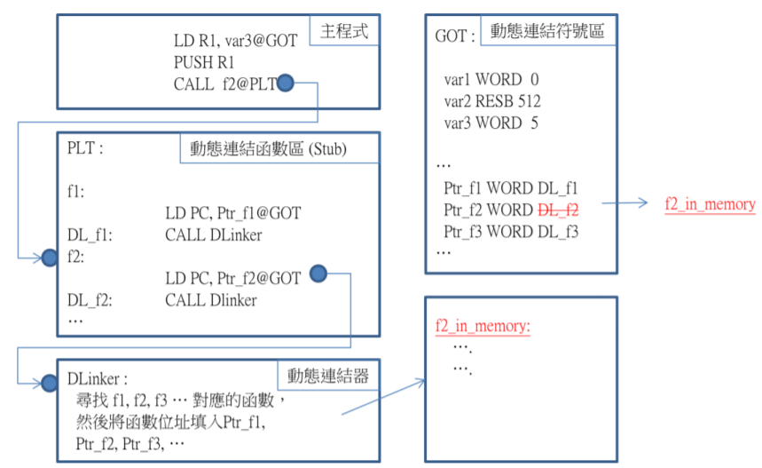
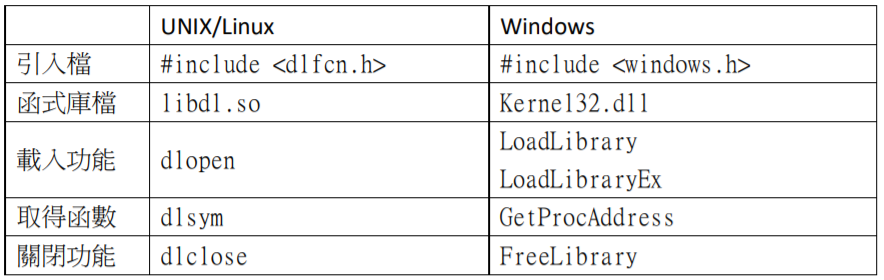

# 動態連結

傳統的連結器會將所有程式連結成單一的執行檔，在執行時只需要該執行檔就能順利執行。但是，使用動態連結機制時，函式庫可以先不需要被連結進來，而是在需要的時候才透過動態連結器 (Dynamic Linker) 尋找並連結函式庫，這種方式
可以不用載入全部的程式，因此可以節省記憶體。當很多執行中的程式共用到函式庫時，動態連結所節省的記憶體數量就相當可觀。

除了節省記憶體之外，動態連結技術還可以節省連結階段所花費的時間。這是因為動態連結函式庫 (Dynamic Linking Libraries: DLLs) 可以單獨被編譯、組譯與連結，程式設計師不需要在改了某個函式庫後就重新連結所有程式。因此，對程式開發人員而言，動態連結技術可以節省程式開發的時間，因為程式設計人員使用編譯、組譯與連結器的次數往往非常頻繁，有些人甚至不到一分鐘就會編譯一次。

除此之外，動態連結函式庫由於可以單獨重新編譯，因此，一但編譯完新版本後，就可以直接取代舊版本。這讓舊程式得以不需重新編譯就能連結到新函式庫，因此，只要將動態連結函式庫換掉，舊程式仍可順利執行該新版的函數，這讓動態函數成為一種可任意抽換的函式庫。

動態連結器的任務，就是在需要的時候才載入動態函式庫，並且進行連結 (linking)與重新定位 (relocation) 的動作。然後再執行該函式庫中的函數。

當程式第一次執行到動態函數時，動態連結器會搜尋看看該函數是否已經在記憶體中，如果有則會跳到該函數執行，如果沒有則會呼叫載入器，動態的將該函式庫載入到記憶體，然後才執行該函數。

使用動態連結機制呼叫函數時，通常會利用間接跳轉的方式，先跳入一個稱為Stub 的程式中。在第一次呼叫該函數時，Stub 會請求動態載入器載入該函數，而在第二次呼叫時，則會直接跳入該函數。

圖 5.17 所顯示了這個動態跳轉機制，在程式剛載入之時，動態連結符號區 GOT當中的 Ptr_f1,Ptr_f2 等變數，會被填入 DL_f1, DL_f2 等位址。當主程式執行 CALL f2@PLT 指令時，會跳到 Stub 區的 f2 標記。此時，會執行 LD PC, Ptr_f2@GOT 這個指令。但是由於 Ptr_f2 當中儲存的是 DL_f2 的位址，因此，該 LD 跳轉指令相當於沒有任何作用。於是會繼續執行 CALL DLinker 這個指令，該指令會呼叫Dlinker 去載入 f2 對應的函數到記憶體中。

一但 f2 的函數內容f2_in_memory被載入後，Dlinker 會將載入f2_in_memory 的位址填入到 Ptr_f2 當中。於是，當下一次主程式再呼叫 CALL f2@PLT 時，Stub 區中的 LD PC, Ptr_f2@GOT 就會直接跳入動態函數 f2_in_memory 中，而不會再透過載入器了。

透過上述的實作方法，就能達成動態連結的目的，讓函式庫動態的掛載到系統當中，等到執行時期才進行連結的動作。動態連結雖然不需要事先載入函式庫，但是在編譯時就已經知道動態函數的名稱與參數類型，因此，編譯器可以事先檢查函數型態的相容性。

動態連結函式庫通常是與位置無關的程式碼 (Position Independent Code)，其優點是可任意抽換函式庫，不需重新連結就能讓系統直接運行。但是，這也可能造成『動態連結地獄』 (DLL hell) 的困境，因為，如果新的函式庫有錯，或者與舊的程式不相容，那麼，原本執行正常的程式會突然出現錯誤，甚至無法使用。

雖然動態連結已經是相當常見的功能，但是在 UNIX/Linux 與 Windows 中卻有不同的稱呼，在 Windows 中直接稱為 DLLs (Dynamic Linking Libraries)，其附檔名通常為 .dll，而在 UNIX/Linux 中的動態連結函式庫則被稱為 Share Objects，其附檔名通常是 .so。

## 動態載入

一但有了『動態連結技術』之後，就能很容易的實作出『動態載入技術』。所謂的動態載入技術，是允許程式在執行時期，再決定要載入哪個函式庫的技術。這種技術比動態連結更具有彈性，靈活度也更高。其方法是讓程式可以呼叫動態載入器，以便載入程式，因此才被稱為動態載入技術。

舉例而言，我們可以讓使用者在程式中輸入某個函式庫名稱，然後立刻用『動態載入技術』載入該函式庫執行。這會使得程式具有較大的彈性，因為，我們可以在必要的時候呼叫動態載入器，讓使用者決定要載入哪些函式庫。

表格 5.1 顯示了 MS. Windows 與 Linux 兩個平台的動態載入函式庫對照表。在Linux 當中，`libdl.so` 函式庫可支援動態載入功能，其引用檔為 dlfcn.h，我們可以用 dlopen() 載入動態函式庫，然後用 dlsym() 取得函數指標，最後用dlclose() 函數關閉函式庫。

而在 MS. Windows 當中，動態函式庫直接內建在核心當中，其引用檔為windows.h，動態連結的目的檔為 Kernel32.dll，可以使用 LoadLibrary() 與
LoadLibraryEx() 等函數載入動態函式庫，然後用 GetProcAddress 取得函數位址，最後用 FreeLibrary() 關閉動態函式庫。

動態載入技術可以說是動態連結的一種自然延伸，只要將作業系統中的動態連結技術獨立成一組函式庫，就能成為動態載入函式庫，這種函式庫對程式設計人員而言，是一種強大的系統函式庫，能夠充分展現出動態連結技術的力量。
