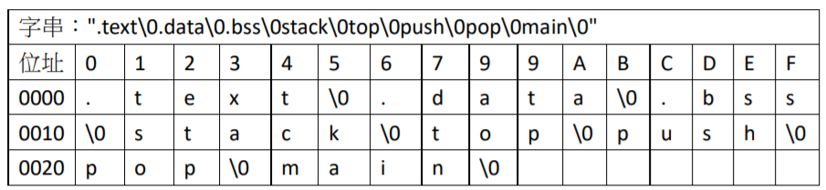
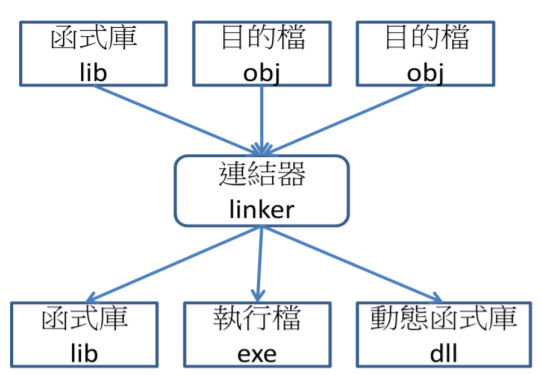
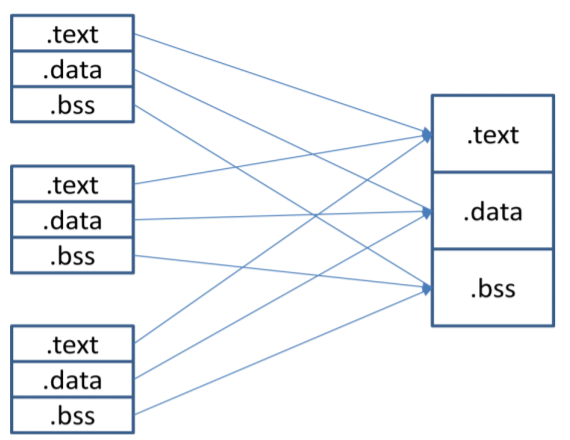
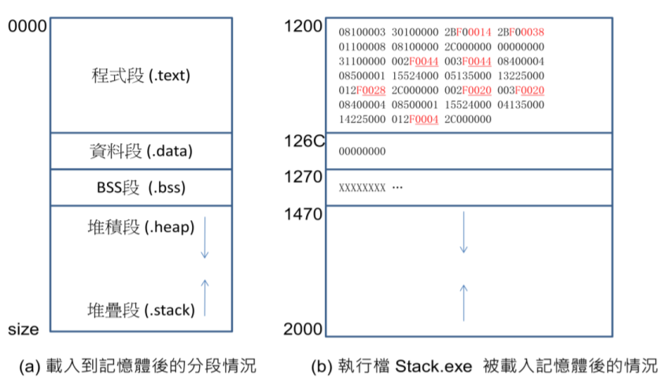

# 連結與載入

連結器是用來將許多目的檔連結成一個執行檔的程式，而載入器則是用來將執行檔載入到記憶體當中執行的程式。在本章中，我們會將焦點放在連結器、載入器與目的檔這三個主題上。

組合語言程式被組譯完成後所輸出的檔案，通常稱為目的檔。假如目的檔中沒有未連結的外部變數，而且已經指定了起始位址，那麼，這種目的檔通常被稱為執行檔，載入器可以將執行檔載入到記憶體當中執行。

但是，如果有外部變數尚未被連結，那麼，目的檔就必須被連結成執行檔後，才能被放入到記憶體中執行。連結器必須計算出區段與變數的位址，並利用修正記錄進行修正後，才能消除這些外部變數，以便將目的檔轉換成執行檔。

其實，對於作業系統而言，執行檔只是一種與目的檔很像的二進位式檔案，例如，當你啟動命令列視窗，輸入某個執行檔的名稱，像是 Windows 中的 test.exe 或Linux 當中的 a.out 時，命令列會呼叫載入器，根據該執行檔的格式，將該執行檔載入到記憶體當中。然後，將程式計數器設定到該程式的啟始位置上，交由CPU 開始執行。

在本章中，我們將討論有關連結器與載入器的設計方式，並且說明目的檔的格式，以及動態連結等進階主題。在最後一節當中，我們將說明 GNU 的連結工具的用法，並以 a.out 格式作為實務案例，以說明連結與載入的真實情況。

## 簡介

組譯器會將組合語言程式轉為目的檔，最簡單的目的檔，是不包含分段結構的純目的碼，這種目的碼的載入非常簡單，我們將在本節當中進行說明，首先，請讀者看看範例 5.1 當中的目的碼。

範例 5.1 是一個 CPU0 程式的組譯報表，該報表列出了每個指令的位址，組合語言與目的碼，這個程式的功能是計算陣列 a 當中元素的總和，並將結果存入到變數 sum 當中。

## 目的檔

到目前為止，我們所看到的組合語言程式，大都是可以完整進行組譯的單一程式。

但是，真實的程式通常會使用到函式庫，這些函式庫中的函數，通常不會與主程式一同組譯，而是在主程式被組譯之前就儲存在函式庫當中了。

主程式必須與函式庫進行連結動作，以便處理函數呼叫與參數傳遞的連結問題，連結器會將函數呼叫等動作，轉換成真實的位址與編碼後，將所有的目的碼集合成一個執行檔，然後才能交給載入器執行。

在實務上，很少看到有單一程式的系統，大部分的程式都需要使用函式庫。但是，假如程式設計師每次都要重新編譯 (或組譯) 所使用到的函式庫，那麼編譯的動作必定非常緩慢。因此，編譯器 (或組譯器) 通常會允許某些外部函數的存在，
這些外部函數通常儲存在另一些目的檔中，然後，在連結的時候，才去解決這些外部引用的情況。

 .bss , .text, .data 這樣的分段指令，代表後續的指令必須被編入該段落中。其中的 .bss 是 Block Started by Symbol 的簡稱，是儲存未初始化全域變數的區段。而 .data 則代表資料段，用來儲存已初始化的全域變數。

假指令 .text 代表內文段 (或稱程式段)，用來儲存程式的指令碼。

假指令 .global 宣告某變數為全域變數，可以供外部的程式引用，像是範例 5.3 當中的 global stack, global top, global push, global pop, global main 等，都是全域
變數的範例。

引用全域變數時必須使用 .extern 指令，以告訴組譯器這些變數是外部變數，才不會因為這些變數未被定義而產生錯誤訊息。像是範例 5.3 當中的 extern stack,extern top, extern push, extern pop 等，都是引用外部變數的範例。

在符號表當中，我們都盡可能的以代號儲存，而避免採用字串的方式，以節省儲存空間。因此，勢必會有一個字串表的存在，以便在必要的時候將代號轉換為字串。目的檔中的字串表通常格式相當簡單，我們可以將 C 語言當中以 \0 結尾的字串，直接串連後所形成的一個表格，圖 5.7 顯示了對應到範例 5.6 的字串表結構，我們特別將其中每個字的位址標示出來，以便讓讀者能更清楚的辨認字串表結構。

目的檔結構的設計，對連結器與載入器的執行速度有相當大的影響，因此，真實的目的檔會盡可能的將各種記錄以最緊湊的格式儲存，以便節省儲存空間，並提升執行速度。

為了有效率的組織目的檔，通常會在目的檔的開頭，加入一個表頭記錄，以儲存各個分段的索引資訊。連結器與載入器會讀取這個表頭記錄，然後再讀出每一個分段的內容。

## 連結器

連結器可以將許多個目的檔連結成一個可執行檔，也有可能是像函式庫 (Library) 或動態函式庫 (DLL) 這樣的半成品，圖 5.9 顯示了連結器的功能，

在連結的過程中，連結器會盡可能的消除外部引用，確定外部變數的位址，讓程式盡可能的接近可執行狀態。另外，還必須進行區段合併的動作，將內文段 (.text)、資料段 (.data) 與 BSS (.bss) 段合併，並且修改符號的位址，更新符號表與修改記錄等，以下讓我們分別說明這些連結器的功能。

## 區段合併

要將一群目的檔連結成一個執行檔，首先會將相同性質的區段合併。例如，所有的內文段 (.text) 會被合併形成單一個內文段，所有的資料段會被合併形成單一個資料段，所有 BSS 段會被合併形成單一個 BSS 段。這個過程如圖 5.10 所示。

連結器必須適當的安排所有區段的位址，將同類型的區段合併，然後修改符號表中每個符號的位址。

## 載入器

組譯器所輸出的檔案稱為目的檔。在上一節當中，我們已經看過幾個目的檔的範例，並且看到了如圖 5.11 所示的執行檔。雖然執行檔中幾乎都是目的碼，但卻不能直接放入記憶體當中就執行。因為，其中仍然有分段資訊與修改記錄等結構。
載入器必須讀取執行檔，組合其中的分段，放入到記憶體中，然後根據修改記錄修正記憶體中的指令區與資料區，最後才將程式計數器 PC 設定為起始指令的位址，開始執行該程式。

圖 5.14 (a) 顯示了一個執行中程式的記憶體配置情況，其中內文段與資料段乃是由目的檔中搬移過來的，BSS 段則只要保留空間大小即可，有些載入器會順便將BSS 段清除為 0，但是有些載入器則不會做這樣的動作，因此，我們通常不能假設載入後 BSS 段的內容都會是 0。在圖 5.14(b) 當中，我們以 XXXXXXX 符號代表其內容值為不確定的情況。

除了目的檔中的區段之外，載入後的程式會多出兩個區段，那便是堆疊段 (Stack)與堆積段 (Heap)。堆疊段用來儲存函數中的參數、區域變數與返回點等資料，如此才能正確進行函數呼叫，甚至執行遞迴函數。而堆積段則用來儲存動態分配的記憶體，像是 C 語言中用 malloc 函數所配置的記憶體，並且可以用 free 函數釋放後回收使用。

通常，堆疊段與堆積段會共用同一塊空間，但是其成長方向相反，這樣才能充分利用中間部分的空間，以避免浪費記憶體。

載入器除了載入內文段、資料段、保留 BSS 段的空間之外，還必須根據修正記錄 M，修改跨區段的變數引用。如此，程式才能正確無誤的執行。

一但目的檔載入完成後，載入器就會將程式計數器 PC 設定為程式的進入點，讓 CPU 開始執行該程式。
