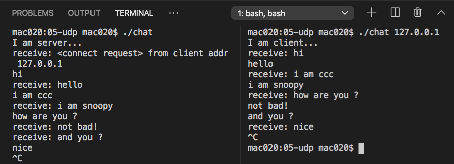

# udp chat


## 編譯

```
$ gcc chat.c -o chat
```

## 執行方法

必須開兩個視窗，其中一個執行 chat 0, 另一個執行 chat 1

User 0: server

```
mac020:05-udp mac020$ ./chat
I am server...
receive: <connect request> from client addr 127.0.0.1
hi
receive: hello
i am ccc
receive: i am snoopy
how are you ?
receive: not bad!
receive: and you ?
nice
^C
```

User 1: client

```
mac020:05-udp mac020$ ./chat 127.0.0.1
I am client...
receive: hi
hello
receive: i am ccc
i am snoopy
receive: how are you ?
not bad!
and you ?
receive: nice
^C
```

最後按 ctrl-c 可以離開！

## 執行畫面


