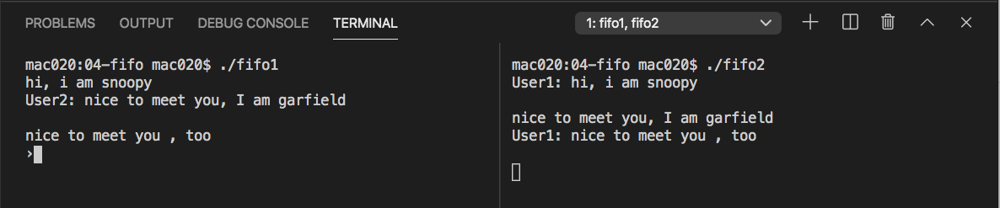

# chat

本範例來自 https://www.geeksforgeeks.org/named-pipe-fifo-example-c-program/

## compile

```
mac020:02-chat mac020$ gcc fifo1.c -o fifo1
mac020:02-chat mac020$ gcc fifo2.c -o fifo2
```

## use



